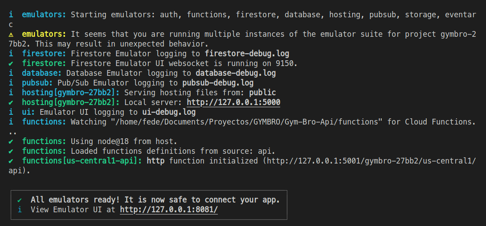
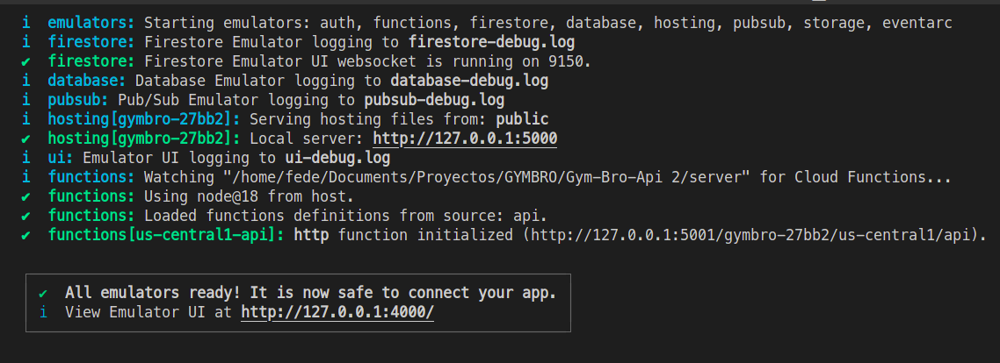
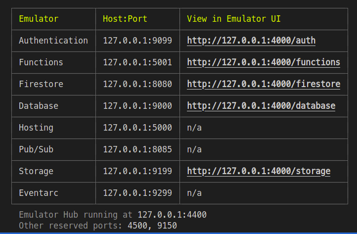
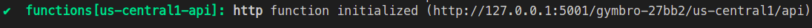

# My Nest.js App with Firebase Function as infrastructure

This is a Nest.js app that uses a Firebase Function as server infrastructure. Locally the tests are running with Emulators Suits (a local runtime environment that emulate the firebase cloud services).

## Installation

1. Clone the repository and navigate to the project directory.
2. Install Node 18 (make sure is that version and not another!)
3. Install firebase tools with this command on terminal:

```bash
$ npm install -g firebase-tools
$ npm install -g firebase-functions@latest firebase-admin@latest firebase@latest
```

\*\* With linux you must do it with sudo prefix.

5. Log in into your firebase account (using google) with this command:

```bash
$ firebase login
```

Press yes to allow permissions.

\*\* If you want to connect a new firebase app to this nest js app, make sure you've been created it in firebase console (as a new firebase project).

6. Firebase init guide:

7. Install all the dependencies with 'npm i'. Make sure you are in the root project directory!

```bash
$ npm install
```

10. Adding Firebase project to the firebase CLI:

Add firebase project to the firebase CLI. You must being logged in so firebase can locate the projects you have access for. Use this command standing on the root project:

```bash
$ firebase use --add
```

and select the gym-bro project (you must requiere access to the project, see contact info)

\**IMPORTANT: give a unique alias to the project. Use *gymbro\*

11. If you have windows OS, install Java and make sure that the Path configuration has the bin files.

## Running firebase locally:

Running firebase emulators will allow you to run all the nest js app into the firebase functions, so you can use all the firebase services as the main infrastructure for this project.

Go to ../functions on terminal, and type:

```bash
$ npm run dev:firebase
```

This will start the firebase:emulators with all the services included in the firebase project like firestore, authentication, storage, and so...

\*\* In Windows You must allow permission for windows. You'll see many Java windows opening. Do not close them.

You should see this kind of message on terminal if everything go rigth:


This will start the firebase:emulators with all the services included in the firebase project like firestore, authentication, storage, and so...

\*\* In Windows You must allow permission for windows. You'll see many Java windows opening. Do not close them.

You should see this kind of message on terminal if everything go rigth:





\*Note: The ports numbers may be differents if you configure them differently in your firebase.json file.
\*Note: The ports numbers may be differents if you configure them differently in your firebase.json file.

## Testing nest locally:

With postman or any other software like that, you can test the "Hello World from Nest Js" so you can see if the Nest js app was successfully embebbed into the firebase project"
With postman or any other software like that, you can test the "Hello World from Nest Js" so you can see if the Nest js app was successfully embebbed into the firebase project"

Request a GET to the url showed in functions green checklist line. It will be unique deppending on your project name and settings.


